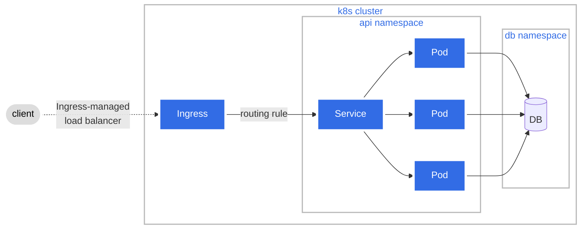
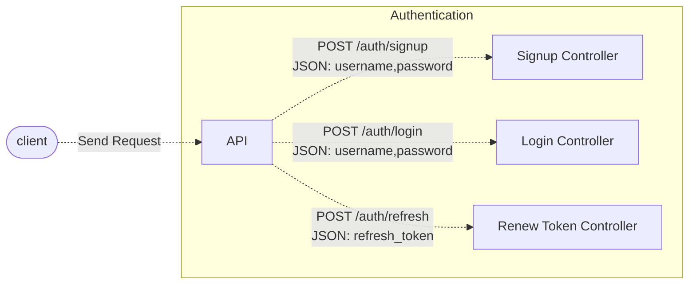
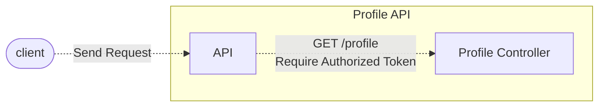
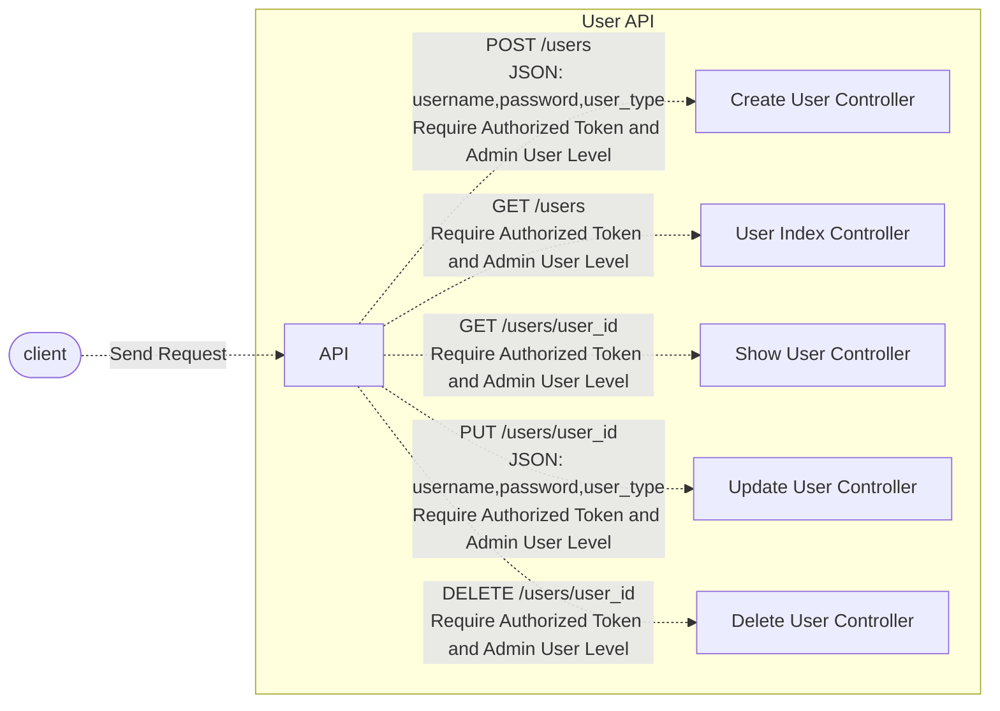

# Architecture Diagram

## System Architecture

```mermaid
graph LR;
  client([client])-. Ingress-managed <br> load balancer .->ingress[Ingress];
  ingress-->|routing rule|service[Service];
  subgraph k8s cluster
  ingress;
    subgraph api namespace
    service-->pod1[Pod];
    service-->pod2[Pod];
    service-->pod3[Pod];
    end
    subgraph db namespace
    pod1-->db[(DB)];
    pod2-->db[(DB)];
    pod3-->db[(DB)];
    end
  end
  
  classDef plain fill:#ddd,stroke:#fff,stroke-width:4px,color:#000;
  classDef k8s fill:#326ce5,stroke:#fff,stroke-width:4px,color:#fff;
  classDef cluster fill:#fff,stroke:#bbb,stroke-width:2px,color:#326ce5;
  class ingress,service,pod1,pod2,pod3 k8s;
  class client plain;
  class cluster cluster;
```

## Flow Authentication

```mermaid
graph LR;
  client([client])-. Send Request .->auth[API];
  subgraph Authentication
  auth-. POST /auth/signup<br>JSON: username,password .->signup[Signup Controller];
  auth-. POST /auth/login<br>JSON: username,password .->login[Login Controller];
  auth-. POST /auth/refresh<br>JSON: refresh_token .->refresh[Renew Token Controller];
  end
```

## Flow API User Profile

```mermaid
graph LR;
  client([client])-. Send Request .->profile[API];
  subgraph Profile API
  profile-. GET /profile<br>Require Authorized Token .->profilecontroller[Profile Controller];
  end
```

## Flow API CRUD User

```mermaid
graph LR;
  client([client])-. Send Request .->user[API];
  subgraph User API
  user-. POST /users<br>JSON: username,password,user_type<br>Require Authorized Token and Admin User Level .->createuser[Create User Controller];
  user-. GET /users<br>Require Authorized Token and Admin User Level .->userindex[User Index Controller];
  user-. GET /users/user_id<br>Require Authorized Token and Admin User Level .->showuser[Show User Controller];
  user-. PUT /users/user_id<br>JSON: username,password,user_type<br>Require Authorized Token and Admin User Level .->updateuser[Update User Controller];
  user-. DELETE /users/user_id<br>Require Authorized Token and Admin User Level .->deleteuser[Delete User Controller];
  end
```
